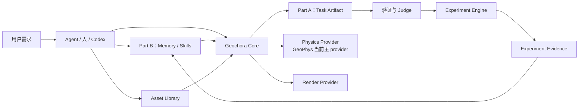
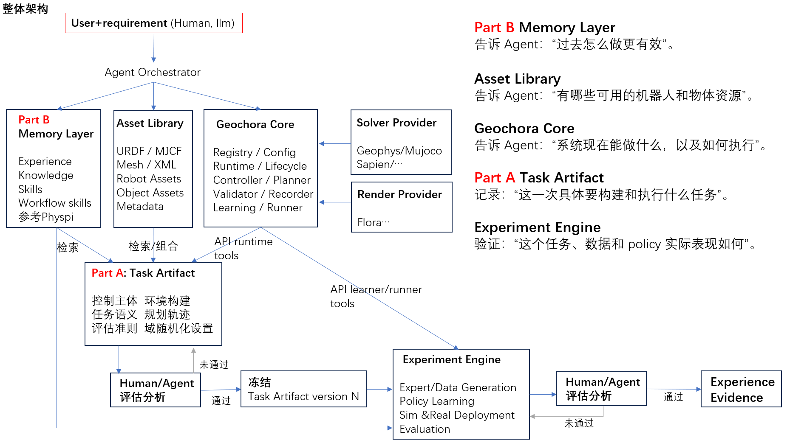
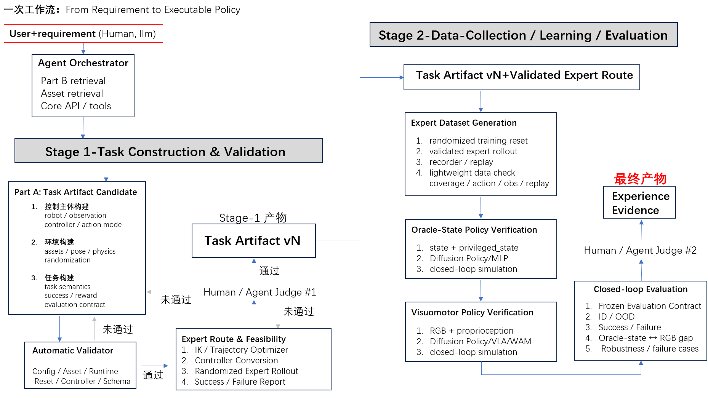
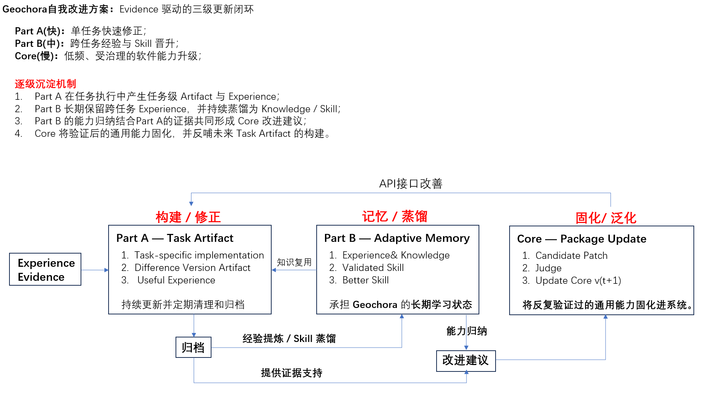

# Geochora

面向具身智能的智能体实验基础设施。

Geochora 不替代物理引擎、控制器、规划器、学习算法或 Agent，而是把它们组织成一条可复现、可验证的任务实验流程：从用户需求出发，构造并验证任务，生成专家数据，训练和评估策略，最后沉淀结构化实验证据。

## 项目定位

Geochora 的核心问题是：如何让一个具身任务从“想做什么”变成“可以执行、可以验证、可以复现、可以改进”的实验对象。

项目中的主要职责划分如下：

| 组成部分 | 主要职责 |
| --- | --- |
| Agent | 理解用户需求、组织工具调用和实验流程 |
| Part B：Memory / Skills | 保存跨任务经验、知识和经过验证的工作流能力 |
| Asset Library | 提供机器人、物体、网格、纹理和其他被动资源 |
| Geochora Core | 提供任务、环境、运行时、控制、记录、学习和评估能力 |
| Physics / Runtime Provider | 决定物理世界如何演化；当前以 GeoPhys 为主 |
| Render Provider | 产生视觉观测和展示帧 |

Geochora Core 必须能够在没有 Agent、Part B 和外部 Asset Library 的情况下独立工作。人或 Codex 应当可以仅使用 Core API 和本地/默认资源完成任务构造、验证、数据采集、策略评估和结果报告。

## 总体架构



当前仓库中的 Core 实现位于 [`task_env/`](task_env/)。GeoPhys 作为独立 Git 子模块提供物理/runtime 能力；Core 通过明确的 provider 边界使用它，不依赖 GeoPhys 的私有 solver 或 renderer 内部实现。



## 一次任务的标准流程

### 阶段一：任务构造与验证

```text
用户需求
  -> Task Artifact candidate
  -> 机器人 / 场景 / 任务构造
  -> 自动 Validator
  -> 专家路线与随机化可行性验证
  -> Judge #1
  -> 冻结 Task Artifact vN
```

自动 Validator 负责检查定义和运行时有效性，包括配置、资产、provider 能力、初始状态、控制器/动作兼容性以及观测契约。专家路线负责检查当前实现是否能够执行；专家求解失败不能直接等同于任务本身不可行。通过 Judge 后，Task Artifact 才能被冻结并供实验引用。

### 阶段二：数据、学习与评估

```text
Frozen Task Artifact
  -> 专家数据生成
  -> 记录 / 回放 / 数据检查
  -> 策略训练
  -> 闭环仿真评估
  -> ID / OOD 与失败案例分析
  -> Judge #2
  -> Experiment Evidence
```

阶段二可以在阶段一允许的范围内调整训练参数和随机化策略，但不能静默修改任务语义、成功标准、随机化硬边界或冻结的评估分布。实验事实写入 evaluation report，是否接受由独立的 Judge decision 记录。



## 当前 Core 能力

`task_env` 当前提供或集成以下能力：

- 环境、任务、机器人、物体和场景注册与配置；
- Gymnasium 风格的单环境生命周期，以及同构并行环境；
- 状态、特权状态、相机观测和渲染 provider；
- `absolute_pose`、`delta_pose`、`absolute_joint` 等控制/动作转换；
- 规划器和专家路线接入点；
- transition / trajectory 记录、H5 数据集、回放和转换；
- SB3、RSL-RL 等 learner 边界及 `runner(env, policy)` 式闭环执行；
- 任务评估、报告、实验和证据基础设施。

常用公共入口为：

```python
from task_env import make_env, make_parallel_env

env = make_env(
    "pendulum-v1",
    config={"runtime": {"backend": "cpu"}},
)
```

具体 API、配置和脚本入口见 [`task_env/README.md`](task_env/README.md) 及 [`task_env/doc/`](task_env/doc/)。

## 当前开发重点与能力边界

主要 feature-development 路线是刚体和铰接刚体操作：

```text
PickCube -> NutAssembly -> Agent 生成的相近但未见过的操作任务
```

Go2 walk / RSL 是当前需要保持的 locomotion / RL 回归路线。当前 provider 范围如下：

| 能力 | 当前状态 |
| --- | --- |
| GeoPhys physics/runtime | 当前 canonical provider，持续进行资格验证 |
| Linux 默认渲染 | GeoPhys 默认 renderer |
| Flora | provider 接入路径，主要面向 Windows，尚非首个 Core milestone 的主路线 |
| MuJoCo / SAPIEN physics provider | 后续 adapter 方向 |

能力声明必须以实际执行证据为准。当前 Go2 CUDA/static/RSL 路线是最强的已资格化路径；PickCube 和 NutAssembly 已有任务语义与相关入口，但完整 physics execution、随机化可行性、采集/保存/加载/回放 oracle 仍在完善，不能仅因任务注册或类可导入就宣称端到端支持。

首个 Core milestone 明确不包含：Part B 存储与检索实现、自动 Skill 提炼、自动 Core patch 生成、软体任务、手机视频到数字孪生、3DGS sim-to-real、大规模 VLA/WAM 训练、强制真实机器人部署，以及 MuJoCo/SAPIEN/Flora 的完整支持。

## 快速开始

### 环境准备

开发通常从仓库根目录执行。需要 Python 3.10+、可用的 GeoPhys 子模块和对应后端依赖；CUDA 训练与大规模并行还需要兼容的 NVIDIA 驱动。

```bash
git submodule update --init --recursive

python -m pip install -r task_env/requirements.txt
# 并行环境、SB3 或 PPO 需要时再安装：
python -m pip install -r task_env/requirements-rl.txt

export PYTHONPATH=GeoPhys/src:.
```

建议使用仓库已有的 GeoPhys Python 环境。不同 physics/render provider 对图形库、GPU 驱动和显示会话的要求不同；无图形环境时优先使用 CPU 或 headless 入口。

### 运行一个最小环境

```bash
PYTHONPATH=GeoPhys/src:. python - <<'PY'
from task_env import make_env

env = make_env("pendulum-v1", config={"runtime": {"backend": "cpu"}})
try:
    observation, info = env.reset(seed=73)
    for _ in range(3):
        observation, reward, terminated, truncated, info = env.step(
            env.action_space.sample()
        )
        if terminated or truncated:
            observation, info = env.reset()
finally:
    env.close()

print("TaskEnv smoke OK")
PY
```

也可以使用脚本入口：

```bash
PYTHONPATH=GeoPhys/src:. python -m task_env.script.env.single_inline \
  --env-id pendulum-v1 --backend cpu --steps 3 --horizon 10
```

### 运行训练或轨迹流程

下面是仓库中已有的参考入口；参数、资源需求和能力边界请以对应脚本及文档为准：

```bash
# Pendulum 并行 PPO smoke
PYTHONPATH=GeoPhys/src:. python -m task_env.script.rl.pendulum_ppo \
  --num-env 8 --backend cpu --updates 3 --rollout-steps 5 \
  --output-dir temp_outputs/task_env/pendulum_ppo_quickstart

# PickCube trajectory collection
PYTHONPATH=GeoPhys/src:. python -m task_env.script.trajectory collect \
  --env_id pick-cube-v1 --backend cpu --num-traj 1 --horizon 600 --no-render \
  --output temp_outputs/task_env/trajectories/source.h5
```

运行产物默认写入 `temp_outputs/`，该目录不属于提交到 Git 的源代码。

## Task Artifact、Experiment 与 Evidence

任务定义、实验配置和实验事实是三个不同的一等对象：

```text
Task Artifact version 1 -> 多个 Experiment
Experiment             -> 一个 canonical Evidence package
```

推荐的本地工作区结构如下。`workspace/` 不提交到 Git：

```text
workspace/
└── tasks/<task_id>/
    ├── artifacts/ver_001/
    │   ├── manifest.yaml
    │   ├── asset.py
    │   ├── solution.py
    │   ├── task.py
    │   ├── validation/
    │   └── judge_decision.yaml
    └── experiments/exp_001/
        ├── experiment.yaml
        ├── evidence.json
        ├── evaluation_report.json
        ├── report.md
        ├── judge_decision.yaml
        ├── videos/
        ├── trajectories/
        └── refs/
```

`evaluation_report.json` 和 `report.md` 记录事实、指标、失败案例和资源信息；`judge_decision.yaml` 记录明确的 approve/reject 决策；`evidence.json` 记录任务、实验、Core/provider 版本、数据、评估结果和产物引用。实验只能引用冻结的 Task Artifact，不能把冻结任务复制成实验内部的临时副本。

## 持续改进模型

Geochora 使用 Evidence 驱动的三级改进闭环：Part A 快速修正当前任务，Part B 跨任务积累并提炼经验与 Skill，Core 将经过反复验证的通用能力固化为受治理的软件更新。三者分别对应不同的更新速度、所有权和审查门槛。



## 仓库边界

```text
Geochora/
├── task_env/   # Geochora Core 的 canonical 实现
├── asset/      # 可复用资产的导入/解析接口
├── GeoPhys/    # GeoPhys Git 子模块与 physics provider
├── docs/       # 当前架构、契约与治理规范
└── workspace/  # 本地任务/实验工作区，不提交到 Git
```

核心边界包括：

- `task_env` 是任务/环境 Core 的唯一 canonical owner，不与 GeoPhys 保留第二份主动维护的 `task_env`；
- GeoPhys 只由 Core 通过 public/runtime-facing API 使用，GeoPhys 不依赖 Geochora；
- 可复用复杂资产归 `asset` 接口管理，简单任务局部资产可以跟随 Task Artifact；
- 单任务修复留在 Task Artifact；跨任务可复用的知识/技能归 Part B；需要改变共享能力的修改才进入 Core，并经过资格与回归验证；
- Core 不通过读取 provider 私有状态来弥补 provider 缺失能力。

## 文档导航

| 主题 | 文档 |
| --- | --- |
| 系统定位、架构和两阶段工作流 | [`docs/global/00-system-architecture-anchor.md`](docs/global/00-system-architecture-anchor.md) |
| 仓库所有权与 provider 边界 | [`docs/global/01-repository-ownership-and-boundaries.md`](docs/global/01-repository-ownership-and-boundaries.md) |
| Core API 与能力范围 | [`docs/module/task_env/02-core-api-and-capability-scope.md`](docs/module/task_env/02-core-api-and-capability-scope.md) |
| Task Artifact、Experiment、Evidence 契约 | [`docs/module/task_env/03-task-artifact-experiment-evidence-contract.md`](docs/module/task_env/03-task-artifact-experiment-evidence-contract.md) |
| Core 资格验证与治理 | [`docs/module/task_env/04-core-qualification-and-governance.md`](docs/module/task_env/04-core-qualification-and-governance.md) |
| TaskEnv API、脚本和 quickstart | [`task_env/README.md`](task_env/README.md) |
| GeoPhys provider | [`GeoPhys/README.md`](GeoPhys/README.md) |

## 开发与验证原则

- 一次只推进一个明确的变更单元，开始前声明范围和非目标；
- 以真实调用路径、运行时/backend provenance 和可复现证据判断能力，不以注册表、可导入类或单个 demo 推断通用支持；
- Core 更新必须保留已有资格化能力，并通过 API/契约、golden-path task 和 provider/system regression 分层验证；
- 评估结果与接受决策分离，Evaluator 产出事实，Judge 产出明确的 approve/reject；
- 任务级变化、可复用技能变化和 Core 能力变化遵循不同的所有权与审查路径。
